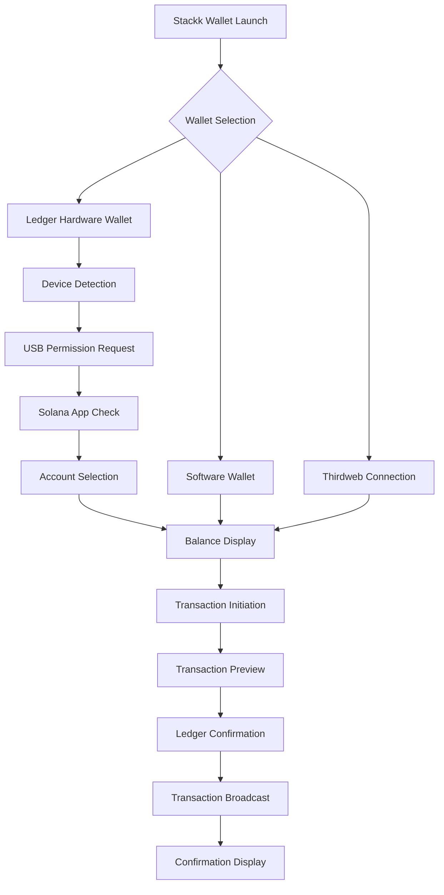

# Stackk Wallet - Ledger Live Integration PRD

## 1. Product Overview

Stackk Wallet Ledger Live Integration enables secure hardware wallet connectivity, allowing users to sign Solana transactions using Ledger Nano devices (S, X, S Plus) while maintaining the wallet's existing functionality for mnemonic-based wallets and external connections.

- **Enhanced Security**: Hardware-based transaction signing eliminates private key exposure to software environments
- **Multi-Wallet Support**: Seamless switching between software wallets, Thirdweb connections, and Ledger hardware devices
- **Professional Integration**: Native Ledger Live protocol support with proper device detection and connection management

## 2. Core Features

### 2.1 User Roles

| Role | Registration Method | Core Permissions |
|------|---------------------|------------------|
| Hardware Wallet User | Ledger device connection + PIN verification | Can connect Ledger, sign transactions, view balances |
| Software Wallet User | Existing mnemonic generation | Can use generated wallets, connect external wallets |
| Multi-Wallet User | Both methods available | Can switch between hardware and software wallets |

### 2.2 Feature Module

Our Ledger integration consists of the following enhanced pages:
1. **Wallet Connection Page**: hardware wallet detection, device selection, connection status management
2. **Transaction Signing Page**: hardware confirmation workflow, transaction preview, signing status
3. **Settings Page**: device management, derivation path configuration, connection preferences
4. **Dashboard Page**: unified balance display, wallet type indicators, seamless wallet switching

### 2.3 Page Details

| Page Name | Module Name | Feature description |
|-----------|-------------|---------------------|
| Wallet Connection | Ledger Detection | Automatically detect connected Ledger devices, display connection status, handle USB permissions |
| Wallet Connection | Device Selection | Allow users to choose between multiple connected devices, display device information |
| Wallet Connection | Connection Management | Establish secure connection, verify device authenticity, handle connection errors |
| Transaction Signing | Transaction Preview | Display transaction details on both web interface and Ledger screen for verification |
| Transaction Signing | Hardware Confirmation | Guide users through Ledger device confirmation process, display signing status |
| Transaction Signing | Error Handling | Handle device disconnection, user rejection, timeout scenarios with clear messaging |
| Settings | Derivation Path Config | Allow custom derivation paths, support multiple accounts, save user preferences |
| Settings | Device Management | Display connected devices, manage multiple Ledger connections, device firmware info |
| Dashboard | Unified Balance Display | Show balances from all connected wallets (software + hardware) in single interface |
| Dashboard | Wallet Type Indicators | Clear visual indicators for wallet types, easy switching between wallet sources |

## 3. Core Process

### Hardware Wallet User Flow
1. **Device Connection**: User connects Ledger device via USB, opens Solana app on device
2. **Detection & Setup**: Stackk Wallet detects device, requests USB permissions, establishes connection
3. **Account Selection**: User selects derivation path/account, wallet displays public key and balances
4. **Transaction Creation**: User initiates SOL/SPL token transfer through Stackk Wallet interface
5. **Hardware Confirmation**: Transaction details appear on Ledger screen, user confirms on device
6. **Transaction Broadcast**: Signed transaction is broadcast to Solana network, confirmation displayed

### Multi-Wallet User Flow
1. **Wallet Selection**: User chooses between software wallet, Thirdweb connection, or Ledger device
2. **Seamless Switching**: Interface adapts to selected wallet type, maintains transaction history
3. **Unified Experience**: All wallet types use same UI for transfers, balance viewing, token management

## 4. User Interface Design

### 4.1 Design Style

- **Primary Colors**: Maintain existing gradient theme (#6366f1 to #9333ea) with Ledger blue accents (#1DB584)
- **Hardware Indicators**: Distinctive icons and badges for hardware wallet connections (shield icons, USB symbols)
- **Button Styles**: Enhanced 3D buttons for hardware actions, pulsing animations for device confirmation states
- **Typography**: Existing font hierarchy with bold emphasis for security-critical information
- **Layout**: Card-based design with dedicated hardware wallet section, expandable device management panels
- **Status Indicators**: LED-style connection indicators, progress bars for signing operations, clear error states

### 4.2 Page Design Overview

| Page Name | Module Name | UI Elements |
|-----------|-------------|-------------|
| Wallet Connection | Ledger Detection | USB connection animation, device discovery spinner, connection status badges with green/red indicators |
| Wallet Connection | Device Selection | Device cards with model images, firmware version display, selection radio buttons with Ledger branding |
| Transaction Signing | Hardware Preview | Split-screen layout showing web transaction details and Ledger screen mockup, confirmation progress indicator |
| Transaction Signing | Status Display | Real-time status updates, animated confirmation flow, error messages with troubleshooting links |
| Settings | Device Management | Tabbed interface for device settings, derivation path input with validation, connection history table |
| Dashboard | Wallet Switcher | Dropdown selector with wallet type icons, balance cards with hardware/software indicators |

### 4.3 Responsiveness

Desktop-first design with mobile-adaptive layouts. Touch interaction optimization for mobile users, with larger touch targets for hardware wallet operations and simplified confirmation flows on smaller screens.

## 5. Security Considerations

### 5.1 Hardware Security Benefits
- **Private Key Isolation**: Private keys never leave the Ledger device, eliminating software-based key exposure
- **Transaction Verification**: Users verify transaction details on Ledger screen before signing
- **Secure Element**: Transactions signed within Ledger's secure element chip

### 5.2 Web Integration Security
- **USB Permissions**: Proper WebUSB API usage with user consent for device access
- **Transport Security**: Encrypted communication between web app and Ledger device
- **Session Management**: Secure session handling with automatic timeout and re-authentication

### 5.3 User Safety Features
- **Transaction Confirmation**: Mandatory on-device confirmation for all transactions
- **Address Verification**: Display and verify recipient addresses on Ledger screen
- **Amount Verification**: Clear amount display in both SOL and USD equivalent on device
- **Network Warnings**: Enhanced warnings when switching between devnet and mainnet with hardware wallets

## 6. Error Handling & User Guidance

### 6.1 Common Error Scenarios
- **Device Not Connected**: Clear instructions with USB connection diagrams
- **Solana App Not Open**: Step-by-step guide to open Solana app on Ledger
- **User Rejection**: Friendly messaging when user rejects transaction on device
- **Device Timeout**: Automatic retry mechanisms with user notification
- **Firmware Issues**: Compatibility checks with upgrade recommendations

### 6.2 User Education
- **First-Time Setup Guide**: Interactive tutorial for Ledger connection process
- **Security Best Practices**: Educational content about hardware wallet benefits
- **Troubleshooting Section**: Comprehensive FAQ with visual guides
- **Video Tutorials**: Embedded guides for device setup and transaction signing

## 7. Integration Requirements

### 7.1 Compatibility Matrix
- **Ledger Models**: Nano S (firmware 2.0+), Nano X (firmware 2.0+), Nano S Plus (firmware 1.0+)
- **Browser Support**: Chrome 61+, Edge 79+, Opera 48+ (WebUSB compatible browsers)
- **Solana App**: Ledger Solana app version 1.3.0+ required on device
- **Network Support**: Full compatibility with both devnet and mainnet operations

### 7.2 Performance Requirements
- **Connection Time**: Device detection within 3 seconds of USB connection
- **Transaction Signing**: Complete signing workflow within 30 seconds
- **Balance Updates**: Real-time balance synchronization across all wallet types
- **Error Recovery**: Automatic reconnection attempts with exponential backoff

## 8. Success Metrics

### 8.1 Adoption Metrics
- **Hardware Wallet Connection Rate**: Percentage of users who successfully connect Ledger devices
- **Transaction Success Rate**: Percentage of hardware-signed transactions that complete successfully
- **User Retention**: Retention rate of users who adopt hardware wallet functionality

### 8.2 Performance Metrics
- **Connection Success Rate**: >95% successful device connections on first attempt
- **Transaction Completion Time**: <30 seconds average for hardware-signed transactions
- **Error Rate**: <2% transaction failures due to hardware integration issues

## 9. Future Enhancements

### 9.1 Advanced Features
- **Multi-Account Support**: Manage multiple Solana accounts from single Ledger device
- **Batch Transactions**: Support for signing multiple transactions in sequence
- **DeFi Integration**: Hardware wallet support for DeFi protocols and staking operations
- **NFT Support**: Ledger-signed NFT transfers and marketplace interactions

### 9.2 Additional Hardware Support
- **Trezor Integration**: Expand to support Trezor hardware wallets
- **Mobile Hardware Wallets**: Support for mobile hardware wallet solutions
- **Biometric Integration**: Enhanced security with biometric confirmation where available