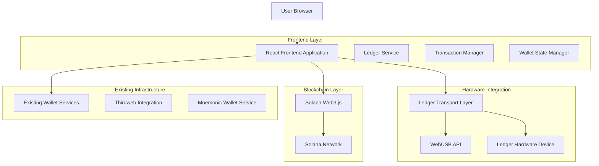
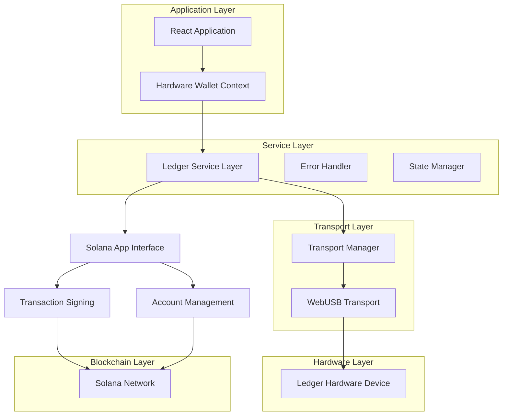
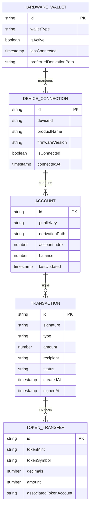

# Stackk Wallet - Ledger Integration Technical Architecture

## 1. Architecture Design



## 2. Technology Description

- **Frontend**: React@19 + TypeScript + Vite
- **Ledger Integration**: @ledgerhq/hw-transport-webusb@6.28.8 + @ledgerhq/hw-app-solana@7.0.12
- **Blockchain**: @solana/web3.js@1.87.6 + @solana/spl-token@0.3.11
- **State Management**: React Context + Custom Hooks
- **UI Components**: Custom components with existing design system
- **Build Tool**: Vite with WebUSB polyfills

## 3. Route Definitions

| Route | Purpose |
|-------|---------|
| / | Enhanced home page with hardware wallet connection options |
| /hardware-setup | Dedicated Ledger setup and connection guide |
| /wallet-manager | Multi-wallet management interface (software + hardware) |
| /transaction/:type | Transaction interface with hardware signing support |
| /settings/hardware | Hardware wallet configuration and device management |

## 4. API Definitions

### 4.1 Ledger Service API

**Device Detection and Connection**
```typescript
interface LedgerService {
  detectDevices(): Promise<LedgerDevice[]>
  connectDevice(deviceId: string): Promise<LedgerConnection>
  disconnectDevice(deviceId: string): Promise<void>
  getDeviceInfo(connection: LedgerConnection): Promise<DeviceInfo>
}
```

**Account Management**
```typescript
interface LedgerSolanaService {
  getPublicKey(derivationPath: string): Promise<PublicKey>
  getMultipleAccounts(paths: string[]): Promise<AccountInfo[]>
  signTransaction(transaction: Transaction, derivationPath: string): Promise<Transaction>
  signMessage(message: Uint8Array, derivationPath: string): Promise<Uint8Array>
}
```

**Transaction Signing Workflow**
```typescript
interface TransactionSigningService {
  prepareTransaction(params: TransactionParams): Promise<Transaction>
  displayTransactionPreview(transaction: Transaction): Promise<void>
  requestHardwareSignature(transaction: Transaction, path: string): Promise<Transaction>
  broadcastTransaction(signedTransaction: Transaction): Promise<string>
}
```

### 4.2 Core Type Definitions

```typescript
interface LedgerDevice {
  id: string
  productName: string
  manufacturerName: string
  serialNumber?: string
  connected: boolean
}

interface LedgerConnection {
  device: LedgerDevice
  transport: Transport
  solanaApp: SolanaApp
  isConnected: boolean
}

interface DeviceInfo {
  version: string
  mcuVersion: string
  seVersion: string
  flags: number
  targetId: string
}

interface AccountInfo {
  publicKey: string
  derivationPath: string
  balance: number
  index: number
}

interface TransactionParams {
  recipient: string
  amount: number
  tokenMint?: string
  memo?: string
  priorityFee?: number
}

interface HardwareWalletState {
  devices: LedgerDevice[]
  activeConnection: LedgerConnection | null
  selectedAccount: AccountInfo | null
  isConnecting: boolean
  error: string | null
}
```

### 4.3 Error Handling Types

```typescript
enum LedgerErrorCode {
  DEVICE_NOT_FOUND = 'DEVICE_NOT_FOUND',
  CONNECTION_FAILED = 'CONNECTION_FAILED',
  APP_NOT_OPEN = 'APP_NOT_OPEN',
  USER_REJECTED = 'USER_REJECTED',
  TRANSACTION_TIMEOUT = 'TRANSACTION_TIMEOUT',
  FIRMWARE_OUTDATED = 'FIRMWARE_OUTDATED',
  WEBUSB_NOT_SUPPORTED = 'WEBUSB_NOT_SUPPORTED'
}

interface LedgerError {
  code: LedgerErrorCode
  message: string
  details?: any
  recoveryAction?: string
}
```

## 5. Server Architecture Diagram



## 6. Data Model

### 6.1 Data Model Definition



### 6.2 Local Storage Schema

**Hardware Wallet Preferences**
```typescript
interface HardwareWalletPreferences {
  preferredDevice?: string
  defaultDerivationPath: string
  autoConnect: boolean
  confirmationTimeout: number
  lastConnectedDevices: string[]
}
```

**Account Cache**
```typescript
interface AccountCache {
  [publicKey: string]: {
    derivationPath: string
    balance: number
    tokenBalances: TokenBalance[]
    lastUpdated: timestamp
  }
}
```

**Transaction History**
```typescript
interface TransactionHistory {
  [signature: string]: {
    type: 'SOL' | 'SPL'
    amount: number
    recipient: string
    status: 'pending' | 'confirmed' | 'failed'
    timestamp: number
    deviceUsed: string
  }
}
```

## 7. Implementation Strategy

### 7.1 Phase 1: Core Integration (Week 1-2)
- Install and configure Ledger dependencies
- Implement basic device detection and connection
- Create hardware wallet context and state management
- Add WebUSB permissions handling

### 7.2 Phase 2: Transaction Signing (Week 3-4)
- Implement Solana app communication
- Add transaction preparation and signing workflow
- Create hardware confirmation UI components
- Integrate with existing transaction system

### 7.3 Phase 3: UI/UX Enhancement (Week 5-6)
- Design and implement hardware wallet UI components
- Add device management interface
- Create setup wizard and user guides
- Implement error handling and recovery flows

### 7.4 Phase 4: Testing & Optimization (Week 7-8)
- Comprehensive testing across different devices
- Performance optimization and error handling
- Security audit and best practices implementation
- Documentation and user guides

## 8. Security Implementation

### 8.1 Transport Security
- **Encrypted Communication**: All data between web app and Ledger device encrypted
- **Device Verification**: Verify device authenticity before establishing connection
- **Session Management**: Secure session tokens with automatic expiration

### 8.2 Transaction Security
- **Double Verification**: Transaction details verified on both web interface and device screen
- **Blind Signing Prevention**: Full transaction parsing and display on Ledger
- **Replay Attack Protection**: Nonce-based transaction uniqueness

### 8.3 Privacy Protection
- **No Key Exposure**: Private keys never leave the hardware device
- **Minimal Data Storage**: Only public keys and preferences stored locally
- **Secure Derivation**: BIP44 derivation paths with proper validation

## 9. Performance Optimization

### 9.1 Connection Management
- **Connection Pooling**: Reuse established connections when possible
- **Automatic Reconnection**: Smart reconnection with exponential backoff
- **Device Caching**: Cache device information to reduce connection overhead

### 9.2 Transaction Optimization
- **Batch Operations**: Support for multiple account queries in single request
- **Parallel Processing**: Concurrent balance updates for multiple accounts
- **Smart Caching**: Cache transaction results with appropriate TTL

### 9.3 UI Performance
- **Lazy Loading**: Load hardware wallet components only when needed
- **Virtual Scrolling**: Efficient rendering of large account/transaction lists
- **Optimistic Updates**: Immediate UI feedback with background verification

## 10. Testing Strategy

### 10.1 Unit Testing
- **Service Layer Tests**: Mock Ledger transport for isolated testing
- **Component Tests**: React Testing Library for UI component validation
- **Hook Tests**: Custom hook testing with mock hardware wallet state

### 10.2 Integration Testing
- **Hardware Device Tests**: Automated tests with Ledger device simulators
- **Network Tests**: Transaction signing and broadcasting validation
- **Cross-Browser Tests**: WebUSB compatibility across supported browsers

### 10.3 End-to-End Testing
- **User Journey Tests**: Complete wallet setup and transaction flows
- **Error Scenario Tests**: Device disconnection and error recovery
- **Performance Tests**: Connection speed and transaction throughput

## 11. Deployment Considerations

### 11.1 Browser Compatibility
- **WebUSB Support**: Chrome 61+, Edge 79+, Opera 48+
- **HTTPS Requirement**: WebUSB only works over secure connections
- **Permissions**: Proper handling of USB device permissions

### 11.2 Build Configuration
- **Vite Configuration**: WebUSB polyfills and proper bundling
- **Environment Variables**: Ledger-specific configuration options
- **Asset Optimization**: Minimize bundle size for hardware wallet features

### 11.3 Production Deployment
- **CDN Optimization**: Efficient delivery of Ledger integration assets
- **Error Monitoring**: Comprehensive logging for hardware wallet issues
- **Feature Flags**: Gradual rollout of hardware wallet functionality